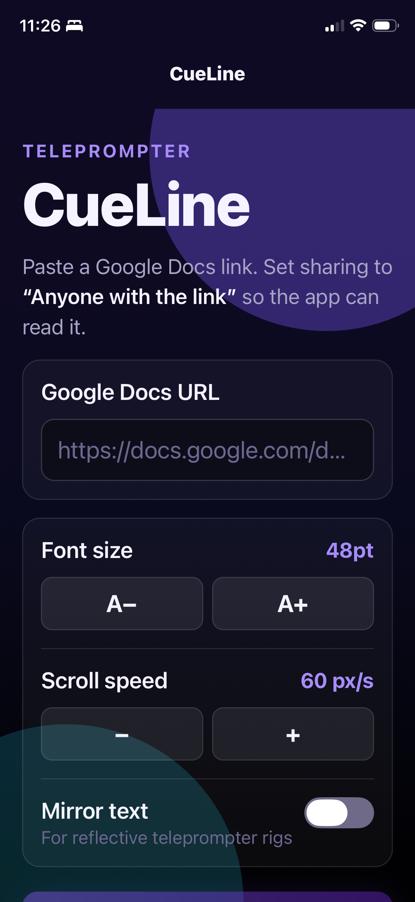
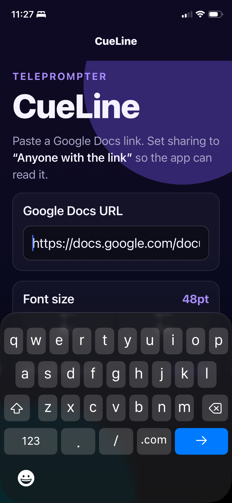
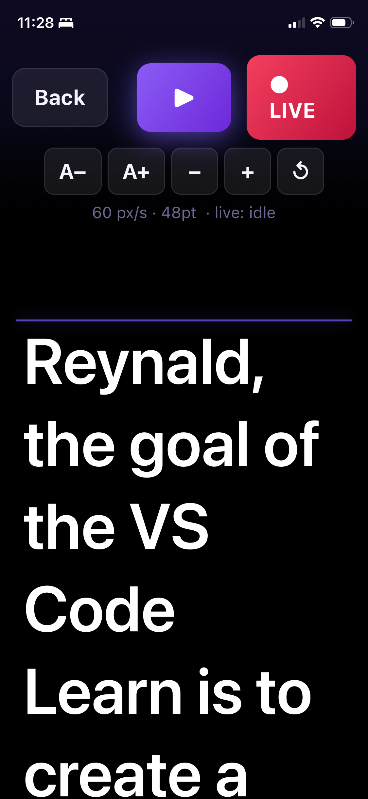

# CueLine

A simple iOS/Android teleprompter built with Expo (Expo Go compatible). Loads
script text directly from a Google Doc you paste in.

## Screenshots

<p align="center">
  
  
  
</p>

## How Google Docs loading works

The app fetches the doc's plain‑text export from
`https://docs.google.com/document/d/<ID>/export?format=txt`.

For this to succeed in Expo Go (no OAuth), the doc must be shared as
**Anyone with the link can view**:

1. Open your Google Doc.
2. Click **Share**.
3. Under **General access**, choose **Anyone with the link**, role **Viewer**.
4. Copy the link and paste it into the app.

If the doc is private, Google returns a sign‑in HTML page and the app shows an
explanatory error.

## Run it

```bash
npm install
npx expo start
```

Then scan the QR code with the Expo Go app on your iPhone.

## Features

- Paste a Google Docs URL (or just the doc ID) and load its text
- Adjustable font size and scroll speed
- Play / pause, restart, mirror toggle (for beam‑splitter rigs)
- Tap the script area to show/hide controls
- Last doc + settings are remembered between launches
- Reading-line indicator at 40% from the top

## Project layout

- [App.tsx](App.tsx) – navigation root
- [src/HomeScreen.tsx](src/HomeScreen.tsx) – URL input + settings
- [src/TeleprompterScreen.tsx](src/TeleprompterScreen.tsx) – scrolling view
- [src/googleDocs.ts](src/googleDocs.ts) – URL parsing + text fetch
- [src/storage.ts](src/storage.ts) – AsyncStorage persistence
